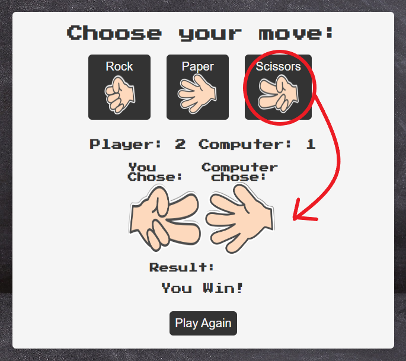

# Rock, Paper, Scissors

**Developer: Anthony Haj Ibrahim**

## Table of Content
  - [Project Goals](#project-goals)
    - [User Goals](#user-goals)
    - [Site Owner Goals](#site-owner-goals)
  - [User Experience](#user-experience)
    - [Target Audience](#target-audience)
    - [User Requirements and Expectations](#user-requirements-and-expectations)
  - [User Stories](#user-stories)
    - [Site User](#site-user)
    - [Site Owner](#site-owner)
  - [Design](#design)
    - [Color Scheme](#colour-scheme)
    - [Fonts](#fonts)
    - [Structure](#structure)
  - [Technologies Used](#technologies-used)
    - [Languages](#languages)
    - [Frameworks, Libraries & Tools](#frameworks-libraries--tools)
  - [Features](#features)
  - [Validation](#validation)
    - [HTML Validation](#html-validation)
    - [CSS Validation](#css-validation)
    - [JavaScript Validation](#javascript-validation)
    - [Accessibility](#accessibility)
    - [Performance](#performance)
  - [Testing](#testing)
    - [Performing tests on various devices](#performing-tests-on-various-devices)
    - [Browser compatibility](#browser-compatibility)
    - [Testing user stories](#testing-user-stories)
  - [Bugs](#bugs)
  - [Deployment](#deployment)
  - [Credits](#credits)
  - [Acknowledgements](#acknowledgements)

  ## Project Goals
  - The goal of this project was to create a simple rock, paper, scissors game that is interactive

  ### User Goals
  - Play a rock, paper, scissors game against a computer

  ### Site Owner Goals
  - To make a game that is simple and interactive
  - To make a game that keeps track of score 
  - To make a game that can be played on any device

  ## User Experience

  ### Target Audience
  - Anyone who enjoys rock, paper, scissors

  ### User Requirements and Expectations
  - Easy and simple mechanics
  - Scoring system to track winner
  - Display results for each move and game winner
  - Responsiveness on all devices
  - Link to project repo 

  ## User Stories

  ### Site User
  1. I want to see the moves I can choose
  2. I want to see what move the computer has chosen
  3. I want to keep track of the score
  4. I want to know if I have won or lost the game
  5. I want to be able to play again

  ### Site Owner
  6. I want the user to see an animation of the computer choice
  7. I want the score to update correctly for user and computer
  8. I want the user to be able to see the repo for the game

 ## Design

 ### Color Scheme
- For the color scheme I went with a simple black and white

### Fonts
- For the font I went with a retro game style taken from google fonts called "Press Start 2P"

### Structure
- The game was created using just one page consisting of a container for the main game

## Technologies Used

### Languages
- HTML
- CSS
- Javascript

### Frameworks, Libraries & Tools
- Git
- Github
- Am I Responsive
- Font Awesome
- WC3 Validator
- Google Fonts
- Microsoft Paint
- TinyPNG

## Features

### Game title
- Title of the game in retro game font

See feature

### Move selection
- 3 button prompting user to choose a move starting the first round

See feature

### Score
- 2 score areas showing player score and computer score

See feature

### Moves chosen 
- Shows the move chosen by player and computer move with shifting animation cycling for possible choices until landing on a random choice

See feature

### Result and play again
- Shows result for current round and end result for game winner and a play again button for reseting game

See feature

## Validation

### HTML Validation
The W3C Markup Validation Service was used to validate the HTML of the website. A pass with no errors

Index Page

### CSS Validation
The W3C Jigsaw CSS Validation Service was used to validate the CSS of the website. A pass with no errors

All CSS

### Javascript Validation
JsHint JS Validation Service was used to validate the Javascript code. No errors found

Js Code

### Accessibility
The WAVE WebAIM web accessibility evaluation tool was used to test accessibility. No errors found however contrast errors show a white background styling error for the main header text and footer paragraph although no such style exists

Wave Validator

### Performance
Google Lighthouse in Google Chrome Developer Tools was used to test the performance 

Lighthouse Validator

## Testing

### Device Testing
The website was tested using Google Chrome Developer Tools sizing all available devices

The website was tested on:
- iPhone 12 pro
- iPad mini
- Lenovo Thinkpad (PC)
- iPhone 7
- iPhone X

### Browser compatibility
Tested on multiple browsers and responsiveness and design works as expected
- Tested on Google Chrome
- Tested on Firefox
- Tested on Microsoft Edge
All browsers respond well. All fonts, links, and images work as expected.

### Testing user stories
1. I want to see the moves I can choose

| **Feature**         | **Action**         | **Expected Result**                       | **Actual Result** |
| ------------------- | ------------------ | ----------------------------------------  | ----------------- |
| Choose move buttons | Click on the icons | Game starts and move chosen image updates | Works as expected |

Screenshot

2. I want to see what move the computer has chosen

| **Feature**         | **Action**         | **Expected Result**                          | **Actual Result** |
| ------------------- | ------------------ | -------------------------------------------  | ----------------- |
| Computer choice     | Click on the icons | Game starts and computer chooses random move | Works as expected |

Screenshot

3. I want to keep track of the score

| **Feature**         | **Action**                       | **Expected Result**                          | **Actual Result** |
| ------------------- | -------------------------------- | -------------------------------------------  | ----------------- |
| Scoreboard          | Choosing each move updates score | Game updates score based on win or lose      | Works as expected |

Screenshot

4. I want to know if I have won or lost the game

| **Feature**  | **Action**                               | **Expected Result**                          | **Actual Result** |
| ------------ | ---------------------------------------- | -------------------------------------------  | ----------------- |
| Game Result  | Game result updates on win or lose state | Game notifies when player wins or loses      | Works as expected |

Screenshot

5. I want to be able to play again

| **Feature**         | **Action**                    | **Expected Result**             | **Actual Result** |
| ------------------- | ----------------------------- | ------------------------------  | ----------------- |
| Play again button   | Click on button to play again | Resets game and scoreboard      | Works as expected |

Screenshot

6. I want the user to see an animation of the computer choice

| **Feature**         | **Action**                       | **Expected Result**                      | **Actual Result** |
| ------------------- | -------------------------------- | ---------------------------------------  | ----------------- |
| Choose move buttons | Click on button to choose a move | Shows animation for random computer move | Works as expected |

Screenshot

7. I want the score to update correctly for user and computer

| **Feature**         | **Action**                       | **Expected Result**           | **Actual Result** |
| ------------------- | -------------------------------- | ----------------------------  | ----------------- |
| Choose move buttons | Click on button to choose a move | Score updates based on winner | Works as expected |

Screenshot

## Bugs
- Bug in javascript file for missing semicolons. Fixed by adding corresponding semicolons
- Bug in footer anchor element due to extra closing tag. Fixed by deleting
- Container div was not fitting correctly in the middle of page. Fixed by using top and left property
- Background image was not showing due to incorrect filepath. Fixed by using ../ instead of ./ in css stylesheet
- Footer was appearing about container. Fixed by changing position to fixed and adding a top property
- Recieved error for not having text inside my footer anchor element although it is only a font awesome icon. Fixed by adding aria-label to describe link"

